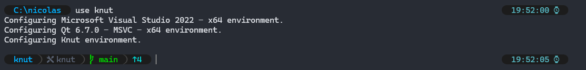

# Clink Setup

This repository contains a terminal profile based on clink and other tools.

## Installation

### Dependencies

The easiest way to get started is to install [scoop](https://scoop.sh/) for all the dependencies. Open a powershell terminal, and type:

```pwsh
Set-ExecutionPolicy -ExecutionPolicy RemoteSigned -Scope CurrentUser
Invoke-RestMethod -Uri https://get.scoop.sh | Invoke-Expression
scoop install git
scoop bucket add nerd-fonts
```

This will install `scoop` with the main bucket, as well as the `nerd-fonts` bucket (needed for the terminal font we are going to use). You need to install `git` before adding the new bucket.

Then it's time to install all the useful tools used for the terminal:

```
scoop install cascadiacode-nf clink clink-completions bat fd fzf jq ripgrep sudo vim which zoxide
```

### Terminal integration

First, checkout the current repository as well as the sub-modules:

```
git clone https://github.com/narnaud/clink-terminal.git
git submodule update --init --recursive
```

Then it's time to integrate the profile in the Terminal application:

- open the Terminal
- go to the settings
- pick the `Command Prompt` settings
- change the command line to `%SystemRoot%\System32\cmd.exe /K PATH_TO_CLINK_TERMINAL\start_clink.bat`


Also go to the `Defaults` and change the Appearance>Font face to `CaskaydiaCove Nerd Font`.


## What you got

### Prompt

First of course is a nice-looking prompt (you can customize it by editing the `scripts\flexprompt_config.lua`):


The prompt will show different information (some may be hidden if not needed or empty):

- on the left: `battery` ) `path` ) `use tool` ) `git` )
- on the right: `error code` ) `duration` ) `time` )

### Aliases

The config setup some aliases already, but you are free to add more by creating a `%USERPROFILE%\.alias.json`, here is an example file:

```json
{
    "l": "git log --graph --pretty=format:\"%Cred%h%Creset -%C(yellow)%d%Creset %s %Cgreen(%cr) %C(bold blue)<%an>%Creset\" --abbrev-commit --date=relative",
    "s": "git status",
    "d": "git diff",
    "more": "bat -f -p",
    "np": "\"C:\\Program Files\\Notepad++\\notepad++.exe\"",
    "xhost": "sudo code C:\\Windows\\tem32\\Drivers\\etc\\hosts",
}
```

### Project configuration

The current setup contains a unique tool named `use` (inspired by [PsEnv](https://github.com/KierDugan/PsEnv)), paired with a json file `%USERPROFILE%\.tools.json`, allowing you to setup an environment for your project. The json file is looking like this:

```json
{
    "msvc2022": {
        "display": "Microsoft Visual Studio 2022 - x64",
        "defer": [
            "C:\\Program Files\\Microsoft Visual Studio\\2022\\Professional\\VC\\Auxiliary\\Build\\vcvars64.bat"
        ]
    },
    "qt6.7": {
        "display": "Qt 6.7.0 - MSVC - x64",
        "set": {
            "QTDIR": "C:\\Qt\\6.7.0\\msvc2019_64\\"
        },
        "append": {
            "CMAKE_PREFIX_PATH": "C:\\Qt\\6.7.0\\msvc2019_64\\"
        },
        "path": [
            "C:\\Qt\\6.7.0\\msvc2019_64\\bin"
        ]
    },
    "knut": {
        "display": "Knut",
        "use": [
            "msvc2022",
            "qt6.7"
        ],
        "go": "C:\\dev\\knut\\knut"
    }
}
```

The json file contains the list of "tools" (or better setup, the name is historical):

- `display`: the string that will be displayed when setting the tool
- `set`: set a list of environment variables
- `append`: append value to a list of environment variables
- `append`: prepend value to a list of environment variables
- `path`: add paths to the `PATH` environment variable
- `defer`: call one or multiple batch files to finish the setup
- `use`: set up other tools before setting up this one
- `go`: go to a particular path at the end of the setup

In the small example, you can see the knut tool is using both the msvc2022 and qt6.7 tools, and will go to the `C:\dev\knut\knut` directory.



In the screenshot, I'm setting up the `knut` tool with `use knut` (note: there is also completion). You can see the display for the different tools set up, as well as a `󱁤 knut` in the prompt, showing the current tool(s) set up.

### Fuzzy finder

`fzf` is integrated all the way into this current terminal configuration. The _default_ shortcuts are:

- `Ctrl+T`: lists files recursively; choose one or multiple to insert them,
- `Ctrl+R`: lists history entries; choose one to insert it,
- `Alt-C`: lists subdirectories; choose one to 'cd /d' to it,
- `Alt-B`: lists key bindings; choose one to invoke it,
- `Ctrl-Space`: uses fzf to filter match completions (and supports '**' for recursive)


It's also used for more advanced tools (`Ctrl+\` will change the preview position or hide it):

- `Ctrl-E`: explorer like view, with directory or file previews
- `Ctrl-g,Ctr-f`: git status, with diff for each file
- `Ctrl-g,Ctr-s`: git stashes list, with diff for each file
- `Ctrl-g,Ctr-h`: git log, with diff for each hash
- `Ctrl-g,Ctr-b`: git branches, with log for each branch


### Other tools

It comes with other nice tools:

- `bat`: a better cat with syntax highlighting
- `fd`: find files in your filesystem
- `rg` (ripgrep): recursive search pattern in directories
- `z` (zoxide): a smarter `cd` command

## 3rd parties

This won't be possible without the help of those giants:

- [bat](https://github.com/sharkdp/bat)
- [cascadiacode](https://github.com/microsoft/cascadia-code)
- [clink](https://chrisant996.github.io/clink/)
- [clink-completions](https://github.com/vladimir-kotikov/clink-completions)
- [clink-flex-prompt](https://github.com/chrisant996/clink-flex-prompt)
- [clink-gizmos](https://github.com/chrisant996/clink-gizmos)
- [clink-zoxide](https://github.com/shunsambongi/clink-zoxide)
- [dirx](https://github.com/chrisant996/dirx)
- [fzf](https://github.com/junegunn/fzf)
- [fd](https://github.com/sharkdp/fd)
- [jq](https://jqlang.github.io/jq/)
- [less](https://greenwoodsoftware.com/less/)
- [ripgrep](https://github.com/BurntSushi/ripgrep)
- [zoxide](https://github.com/ajeetdsouza/zoxide)
