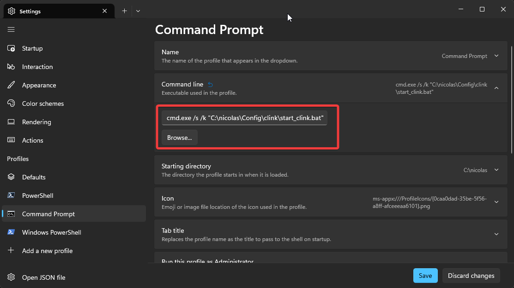
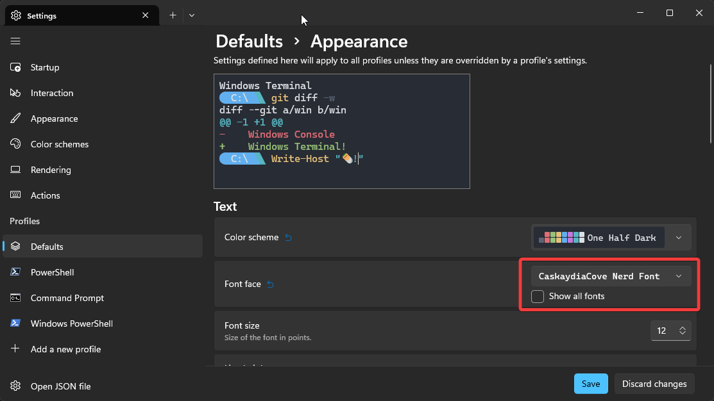
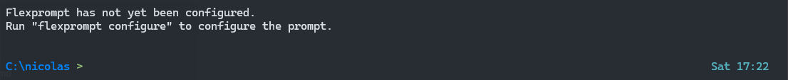
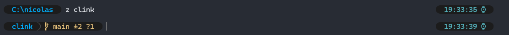
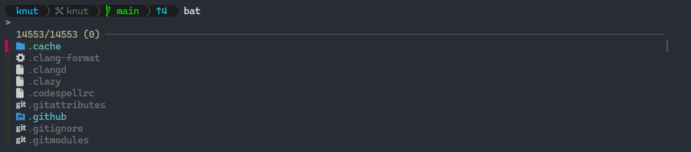
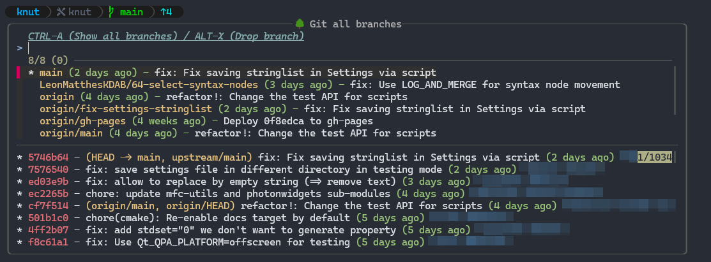

# Clink Setup

This repository contains a [clink](https://chrisant996.github.io/clink/) setup to be used with Windows Terminal.

## Installation

### Via [Scoop](https://scoop.sh/) (preferred)

The easiest way to get started is to install [scoop](https://scoop.sh/) for all the dependencies.

1. Install Scoop

Open a powershell terminal:

```pwsh
Set-ExecutionPolicy -ExecutionPolicy RemoteSigned -Scope CurrentUser
Invoke-RestMethod -Uri https://get.scoop.sh | Invoke-Expression
```

2. Install a nerd font for the terminal (Cascadia Code here, but any other nerd font will work)

```batch
scoop bucket add nerd-fonts
scoop install cascadiacode-nf
```

3. Install **clink-terminal**

```batch
scoop bucket add narnaud https://github.com/narnaud/scoop-bucket
scoop install clink-terminal narnaud/clink-completions narnaud/clink-flex-prompt
```

### Or via zip file

1. Go to the [Releases](https://github.com/narnaud/use/releases) page
2. Download the latest `clink-terminal.zip` file
3. Extract the files from it into a directory.

You also need to install some dependencies, see the list at the bottom.

## Terminal integration

- open the Terminal
- go to the settings
- pick the `Command Prompt` settings
- change the command line to `cmd.exe /s /k clink-terminal`



Also go to the `Defaults` and change the Appearance>Font face to `CaskaydiaCove Nerd Font`.



## Features

### Prompt

The first time you start **clink-terminal**, it will show something like that:


To configure a new prompt, run the configruation wizard with:

```batch
flexprompt configure
```



> [!NOTE]
> Probably one of the best feature of the prompt is that the git status is asynchrone, so you never have to wait for it to finish before being able to enter a command.

### Aliases

The configuration has  some aliases already, but you are free to add more by creating a `%USERPROFILE%\.alias.yaml`, here is an example file:

```yaml
# Git aliases
l: git log --graph --pretty=format:"%Cred%h%Creset -%C(yellow)%d%Creset %s %Cgreen(%cr) %C(bold blue)<%an>%Creset" --abbrev-commit --date=r
elative
s: git status -sb
d: git diff

# Some cli tools
more: bat -f -p
lg: lazygit -sm half
top: btm -b

# Edit configuration files
xhost: sudo helix C:\Windows\tem32\Drivers\etc\hosts
alias: helix %USERPROFILE%\.alias.yaml
```

### Fuzzy finder

`fzf` is integrated all the way into this current terminal configuration. The _default_ shortcuts are:

- <kdb>Ctrl</kdb>+<kdb>T</kdb>: lists files recursively; choose one or multiple to insert them,
- <kdb>Ctrl</kdb>+<kdb>R</kdb>: lists history entries; choose one to insert it,
- <kdb>Alt</kdb>+<kdb>C</kdb>: lists subdirectories; choose one to 'cd /d' to it,
- <kdb>Alt</kdb>+<kdb>B</kdb>: lists key bindings; choose one to invoke it,
- <kdb>Ctrl</kdb>+<kdb>Space</kdb>: uses fzf to filter match completions (and supports '**' for recursive)



It's also used for more advanced views (`Ctrl+\` will change the preview position or hide it):

- <kdb>Ctrl</kdb>+<kdb>E</kdb>: explorer like view, with directory or file previews
- <kdb>Ctrl</kdb>+<kdb>G</kdb>,<kdb>Ctr</kdb>+<kdb>F</kdb>: git status, with diff for each file
- <kdb>Ctrl</kdb>+<kdb>G</kdb>,<kdb>Ctr</kdb>+<kdb>S</kdb>: git stashes list, with diff for each file
- <kdb>Ctrl</kdb>+<kdb>G</kdb>,<kdb>Ctr</kdb>+<kdb>H</kdb>: git log, with diff for each hash
- <kdb>Ctrl</kdb>+<kdb>G</kdb>,<kdb>Ctr</kdb>+<kdb>B</kdb>: git branches, with log for each branch



### Terminal title

If you set the `terminal.update_title` settings to true, you can change the terminal title based on the current folder and git branch.

```batch
clink set terminal.update_title true
```

Once done, the terminal title will change:

- if it's a normal folder: "folder_name"
- if it's a git folder: "git_topfolder_name - [branch_name]"

### Other tools

It comes with other nice tools:

- `bat`: a better cat with syntax highlighting
- `fd`: find files in your filesystem
- `rg` (ripgrep): recursive search pattern in directories
- `z` (zoxide): a smarter `cd` command

## Recommendations

Tools you should install:

- [use](https://github.com/narnaud/use): command line tool to setup environment defined in a json file
- [yazi](https://yazi-rs.github.io/): blazing fast terminal file manager written in Rust, based on async I/O

To install those:

```batch
scoop install use yazi
```

`clink-terminal` comes `y` shell wrapper that provides the ability to change the current working directory when exiting Yazi:

- <kbd>Q</kdb> will exit and change the current working directory
- <kbd>shift</kbd>-<kbd>Q</kbd> will exit without changing the current working directory

## Third parties

This won't be possible without the help of those giants:

- [bat](https://github.com/sharkdp/bat)
- [cascadiacode](https://github.com/microsoft/cascadia-code)
- [clink](https://chrisant996.github.io/clink/)
- [clink-completions](https://github.com/vladimir-kotikov/clink-completions)
- [clink-flex-prompt](https://github.com/chrisant996/clink-flex-prompt)
- [clink-gizmos](https://github.com/chrisant996/clink-gizmos)
- [clink-zoxide](https://github.com/shunsambongi/clink-zoxide)
- [dirx](https://github.com/chrisant996/dirx)
- [fd](https://github.com/sharkdp/fd)
- [fzf](https://github.com/junegunn/fzf)
- [jq](https://jqlang.github.io/jq/)
- [less](https://greenwoodsoftware.com/less/)
- [ripgrep](https://github.com/BurntSushi/ripgrep)
- [scoop](https://github.com/ScoopInstaller/Scoop)
- [yq](https://github.com/mikefarah/yq)
- [zoxide](https://github.com/ajeetdsouza/zoxide)
