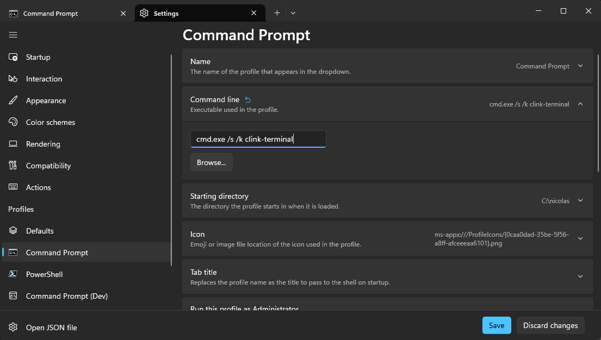

# Clink Setup

This repository contains a terminal profile based on clink and other tools.

## Installation

### Dependencies

The easiest way to get started is to install [scoop](https://scoop.sh/) for all the dependencies. Open a powershell terminal, and type:

```pwsh
Set-ExecutionPolicy -ExecutionPolicy RemoteSigned -Scope CurrentUser
Invoke-RestMethod -Uri https://get.scoop.sh | Invoke-Expression
scoop install git
scoop bucket add nerd-fonts
scoop bucket add narnaud https://github.com/narnaud/scoop-bucket
```

This will install `scoop` with the main bucket, as well as the `nerd-fonts` bucket (needed for the terminal font we are going to use). You need to install `git` before adding the new bucket.

Then it's time to install all the useful tools used for the terminal:

```
scoop install cascadiacode-nf clink bat dirx fd fzf ripgrep vim which zoxide
```

### Terminal integration

First, checkout the current repository as well as the sub-modules:

```
git clone https://github.com/narnaud/clink-terminal.git
git submodule update --init --recursive
```

Then it's time to integrate the profile in the Terminal application:

- open the Terminal
- go to the settings
- pick the `Command Prompt` settings
- change the command line to `%SystemRoot%\System32\cmd.exe /K PATH_TO_CLINK_TERMINAL\start_clink.bat`



Also go to the `Defaults` and change the Appearance>Font face to `CaskaydiaCove Nerd Font`.


## What you got

### Prompt

First of course is a nice-looking prompt (you can customize it by editing the `scripts\flexprompt_config.lua`):


The prompt will show different information (some may be hidden if not needed or empty):

- on the left: `admin` / `battery` / `path` / `use tool` / `git` /
- on the right: \ `error code` \ `duration` \ `time`

> Probably one of the best feature of the prompt is that the git status is asynchrone, so you never have to wait for it to finish before being able to enter a command.

### Aliases

The config setup some aliases already, but you are free to add more by creating a `%USERPROFILE%\.alias.json`, here is an example file:

```json
{
    "l": "git log --graph --pretty=format:\"%Cred%h%Creset -%C(yellow)%d%Creset %s %Cgreen(%cr) %C(bold blue)<%an>%Creset\" --abbrev-commit --date=relative",
    "s": "git status",
    "d": "git diff",
    "more": "bat -f -p",
    "np": "\"C:\\Program Files\\Notepad++\\notepad++.exe\"",
    "xhost": "sudo code C:\\Windows\\tem32\\Drivers\\etc\\hosts",
}
```

### Fuzzy finder

`fzf` is integrated all the way into this current terminal configuration. The _default_ shortcuts are:

- `Ctrl+T`: lists files recursively; choose one or multiple to insert them,
- `Ctrl+R`: lists history entries; choose one to insert it,
- `Alt-C`: lists subdirectories; choose one to 'cd /d' to it,
- `Alt-B`: lists key bindings; choose one to invoke it,
- `Ctrl-Space`: uses fzf to filter match completions (and supports '**' for recursive)


It's also used for more advanced views (`Ctrl+\` will change the preview position or hide it):

- `Ctrl-E`: explorer like view, with directory or file previews
- `Ctrl-g,Ctr-f`: git status, with diff for each file
- `Ctrl-g,Ctr-s`: git stashes list, with diff for each file
- `Ctrl-g,Ctr-h`: git log, with diff for each hash
- `Ctrl-g,Ctr-b`: git branches, with log for each branch


### Other tools

It comes with other nice tools:

- `bat`: a better cat with syntax highlighting
- `fd`: find files in your filesystem
- `rg` (ripgrep): recursive search pattern in directories
- `z` (zoxide): a smarter `cd` command

## Recommendations

Tools you should install:

- [jq](https://jqlang.github.io/jq/): lightweight and flexible command-line JSON processor
- [use](https://github.com/narnaud/use): command line tool to setup environment defined in a json file
- [yazi](https://yazi-rs.github.io/): blazing fast terminal file manager written in Rust, based on async I/O

To install those:

```
scoop install use yazi
```

`clink-terminal` comes `y` shell wrapper that provides the ability to change the current working directory when exiting Yazi:

- <kbd>Q</kdb> will exit and change the current working directory
- <kbd>shift</kbd>-<kbd>Q</kbd>` will exit without changing the current working directory

## 3rd parties

This won't be possible without the help of those giants:

- [bat](https://github.com/sharkdp/bat)
- [cascadiacode](https://github.com/microsoft/cascadia-code)
- [clink](https://chrisant996.github.io/clink/)
- [clink-completions](https://github.com/vladimir-kotikov/clink-completions)
- [clink-flex-prompt](https://github.com/chrisant996/clink-flex-prompt)
- [clink-gizmos](https://github.com/chrisant996/clink-gizmos)
- [clink-zoxide](https://github.com/shunsambongi/clink-zoxide)
- [dirx](https://github.com/chrisant996/dirx)
- [fd](https://github.com/sharkdp/fd)
- [fzf](https://github.com/junegunn/fzf)
- [less](https://greenwoodsoftware.com/less/)
- [ripgrep](https://github.com/BurntSushi/ripgrep)
- [scoop](https://github.com/ScoopInstaller/Scoop)
- [zoxide](https://github.com/ajeetdsouza/zoxide)
