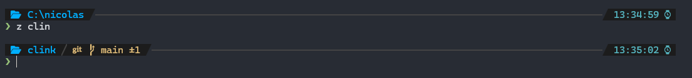

# Clink Setup

This repository contains a [clink](https://chrisant996.github.io/clink/) setup to be used with Windows Terminal.

## Installation

### Via [Scoop](https://scoop.sh/) (preferred)

The easiest way to get started is to install [scoop](https://scoop.sh/) for all the dependencies.

1. Install Scoop

Open a powershell terminal:

```pwsh
Set-ExecutionPolicy -ExecutionPolicy RemoteSigned -Scope CurrentUser
Invoke-RestMethod -Uri https://get.scoop.sh | Invoke-Expression
```

1. Install a nerd font for the terminal (Cascadia Code here, but any other nerd font will work)

```batch
scoop bucket add nerd-fonts
scoop install cascadiacode-nf
```

1. Install **clink-terminal**

```batch
scoop bucket add narnaud https://github.com/narnaud/scoop-bucket
scoop install clink-terminal narnaud/clink-completions narnaud/clink-flex-prompt
```

### Or via zip file

1. Go to the [Releases](https://github.com/narnaud/use/releases) page
2. Download the latest `clink-terminal.zip` file
3. Extract the files from it into a directory.

You also need to install some dependencies, see the list at the bottom.

## Terminal integration

- open the Terminal
- go to the settings
- pick the `Command Prompt` settings
- change the command line to `cmd.exe /s /k clink-terminal`


Also go to the `Defaults` and change the Appearance>Font face to `CaskaydiaCove Nerd Font`.


## Features

### Prompt

The first time you start **clink-terminal**, it will show something like that:


To configure a new prompt, run the configuration wizard with:

```batch
flexprompt configure
```



> [!NOTE]
> Probably one of the best features of the prompt is that the git status is asynchronous, so you never have to wait for it to finish before being able to enter a command.

### Aliases and Commands

`clink-terminal` comes with some handy aliases:

Unix aliases:

- `ls`: our beloved list command
- `ll`: same, but with details
- `cp`: copy a file (using the unix command from git)
- `mv`: move a file (using the unix command from git)
- `rm`: remove a file (using the unix command from git)
- `clear`: clear the console
- `pwd`: display the current directory

New commands:

- `e`: open the Windows file explorer with the current folder
- `preview`: show a preview of the file or folder passed
  - use `dirx` for a folder, and display a tree
  - use `chafa` for an image
  - default to `bat` otherwise
- `y`: run `yazi` file manager (need to be installed)
  - <kbd>Q</kdb> will exit without changing the current working directory
  - <kbd>shift</kbd>-<kbd>Q</kbd> will exit and change the current working directory

### Custom aliases

The configuration has some aliases already, but you are free to add more by creating a `%USERPROFILE%\.config\alias.yaml`, here is an example file:

```yaml
# Git aliases
l: git log --graph --pretty=format:"%Cred%h%Creset -%C(yellow)%d%Creset %s %Cgreen(%cr) %C(bold blue)<%an>%Creset" --abbrev-commit --date=r
elative
s: git status -sb
d: git diff

# Some cli tools
more: bat -f -p
lg: lazygit -sm half
top: btm -b

# Edit configuration files
xhost: sudo helix C:\Windows\tem32\Drivers\etc\hosts
alias: helix %USERPROFILE%\.config\alias.yaml
```

> [!NOTE]
>
> - No need to add the `$*` at the end, it's automatically added for you.
> - For compatibility reason, aliases are also read in `%USERPROFILE%\.alias.yaml`, if the first one is not found.

### Fuzzy finder

`fzf` is integrated all the way into this current terminal configuration. The *default* shortcuts are:

- <kdb>Ctrl</kdb>+<kdb>T</kdb>: lists files recursively; choose one or multiple to insert them,
- <kdb>Ctrl</kdb>+<kdb>R</kdb>: lists history entries; choose one to insert it,
- <kdb>Alt</kdb>+<kdb>C</kdb>: lists subdirectories; choose one to 'cd /d' to it,
- <kdb>Alt</kdb>+<kdb>B</kdb>: lists key bindings; choose one to invoke it,
- <kdb>Ctrl</kdb>+<kdb>Space</kdb>: uses fzf to filter match completions (and supports '**' for recursive)
- <kbd>Tab</kbd>: Tab uses fzf to filter match completions, but only when preceded by '**' (recursive).


### Fuzzy finder views

`clink-terminal` also comes with more advanced views (`Ctrl+\` will change the preview position or hide it):

- <kdb>Ctrl</kdb>+<kdb>E</kdb>: Show a fzf filetered view with files and directory matching search term

- <kdb>Ctrl</kdb>+<kdb>X,<kdb>Ctr</kdb>+<kdb>F</kdb>: Show a fzf filtered view with files matching search term

- <kbd>Ctrl</kbd>+<kbd>G</kbd>,<kbd>?</kbd>: Show key bindings for fzf_git
- <kbd>Ctrl</kbd>+<kbd>G</kbd>,<kbd>Ctrl</kbd>+<kbd>F</kbd>: (***G***it ***F***iles) Use fzf for Files
- <kbd>Ctrl</kbd>+<kbd>G</kbd>,<kbd>Ctrl</kbd>+<kbd>B</kbd>: (***G***it ***B***ranches) Use fzf for Branches
- <kbd>Ctrl</kbd>+<kbd>G</kbd>,<kbd>Ctrl</kbd>+<kbd>T</kbd>: (***G***it ***T***ags) Use fzf for Tags
- <kbd>Ctrl</kbd>+<kbd>G</kbd>,<kbd>Ctrl</kbd>+<kbd>R</kbd>: (***G***it ***R***emotes) Use fzf for Remotes
- <kbd>Ctrl</kbd>+<kbd>G</kbd>,<kbd>Ctrl</kbd>+<kbd>H</kbd>: (***G***it ***H***ashes) Use fzf for commit Hashes (log)
- <kbd>Ctrl</kbd>+<kbd>G</kbd>,<kbd>Ctrl</kbd>+<kbd>S</kbd>: (***G***it ***S***tashes) Use fzf for Stashes
- <kbd>Ctrl</kbd>+<kbd>G</kbd>,<kbd>Ctrl</kbd>+<kbd>L</kbd>: (***G***it ref***L***ogs)Use fzf for reflogs
- <kbd>Ctrl</kbd>+<kbd>G</kbd>,<kbd>Ctrl</kbd>+<kbd>W</kbd>: (***G***it ***W***oktrees) Use fzf for Worktrees
- <kbd>Ctrl</kbd>+<kbd>G</kbd>,<kbd>Ctrl</kbd>+<kbd>E</kbd>: (***G***it ***E***ach ref) Use fzf for Each ref (git for-each-ref)
- <kbd>Ctrl</kbd>+<kbd>X</kbd>,<kbd>Ctrl</kbd>+<kbd>F</kbd>: (***G***it ***C***hanges) Use fzf for Status with diff

> if your terminal support it, set `CLINK_FZF_PREVIEW_SIXELS=1` for better image support


### Terminal title

If you set the `terminal.update_title` settings to true, you can change the terminal title based on the current folder and git branch.

```batch
clink set terminal.update_title true
```

Once done, the terminal title will change:

- if it's a normal folder: "folder_name"
- if it's a git folder: "git_topfolder_name - [branch_name]"

### Other tools

It comes with other nice tools:

- `bat`: a better cat with syntax highlighting
- `fd`: find files in your filesystem
- `rg` (ripgrep): recursive search pattern in directories
- `z` (zoxide): a smarter `cd` command

## Recommendations

Tools you should install:

- [use](https://github.com/narnaud/use): command line tool to setup environment defined in a json file
- [yazi](https://yazi-rs.github.io/): blazing fast terminal file manager written in Rust, based on async I/O

To install those:

```batch
scoop install use yazi
```

## Third parties

This won't be possible without the help of those giants:

- [bat](https://github.com/sharkdp/bat)
- [cascadiacode](https://github.com/microsoft/cascadia-code)
- [chafa](https://hpjansson.org/chafa)
- [clink](https://chrisant996.github.io/clink/)
- [clink-completions](https://github.com/vladimir-kotikov/clink-completions)
- [clink-flex-prompt](https://github.com/chrisant996/clink-flex-prompt)
- [clink-gizmos](https://github.com/chrisant996/clink-gizmos)
- [clink-zoxide](https://github.com/shunsambongi/clink-zoxide)
- [dirx](https://github.com/chrisant996/dirx)
- [fd](https://github.com/sharkdp/fd)
- [fzf](https://junegunn.github.io/fzf/)
- [jq](https://jqlang.github.io/jq/)
- [less](https://greenwoodsoftware.com/less/)
- [ripgrep](https://github.com/BurntSushi/ripgrep)
- [scoop](https://scoop.sh/)
- [yq](https://mikefarah.gitbook.io/yq)
- [zoxide](https://github.com/ajeetdsouza/zoxide)
